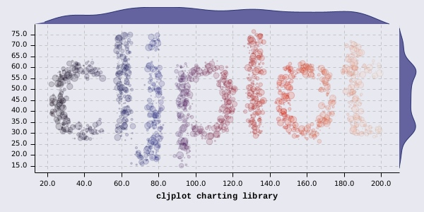

# CLJPLOT

> **_INFO (2020-08-17):_** I'm preparing new version based on tech.ml.dataset as data input which is going to solve issues with data processing and labels. Also rethinking the way of better management of data dimensions and their representation through trellis/colors/axes etc. It happens very slowly, but happens. Stay tuned.

  

# clojure2d.charts

THIS IS WIP/POC
A "no web-based" pure JVM Clojure library for 2d charts, inspired by D3, Vega and R (ggplot2/lattice/facet).

## Current version

`[cljplot "0.0.2a-SNAPSHOT"]`

## NOTE about API

Please note that current way of creating charts is very low level. All of this nasty steps will be finally hidden from user perspective.

## Usage

Currently there are no easy to use functions nor data DSL (help needed here). Still everything is done manually.

See `sketches` folder for examples

## Internals

[How does it work?](INTERNALS.md)

## Short term plan

* More chart types (`+` - easier; `-` - harder):
    - ~~heatmaps (various grids)~~ (`+`)
    - ~~point clouds (log and linear rendering)~~ (`+`)
    - ~~contours (`-`), flow fields (`+`)~~
    - categorical x categorical plots (scatter plot matrix  (`+`)
    - ~~stacked area/stream~~
    - parallel / hive (`+`/`-`)
    - radial charts, like pie (`+`), sunburst (`-`), radial tree (`-`)
    - arc(?) (`+`)
    - markers: line, text, etc...
* ~~Labels~~ / ~~legends~~ / gradients / palettes
* Higher level API
    - single function for each chart type (easier)
    - faceting/lattice (harder)
* cleaning configuration mess

## Long term plan / wishlist

* Enable other renderers (create dispatch layer)
* Data DSL(?)
* geo maps
* elements of UpSet
* signal processing / time series (partially done)
* annotations
* grid of charts / subplots (with independent axes)
* kind of interactivity
* chart styles (now everything is blueish)

## Known issues

* ~~grid, axes sometimes don't match (1-2px shift). This is due to rounding errors and axes rotations~~
* still ~~no labels~~, no legends
* overlapping ticks (add some heuristics to use smaller fonts and smaller number of ticks)
* chart configuration needs to be reviewed, still not consistent
* no higher level functions/macros
* no DSL for data manipulation, and no plan to make it (task for others!)
* deep nesting is really nasty to configure and for data preparation :/ (lattice of stacked horizontally stacked bars...)
* merging nesting extents is not working correctly (in lattice)
* true is, there are some labels for lattice, quick and dirty
* do not layer over histograms (bins mismatch)...
* still something is wrong with time scale

## Why?

So, why another chart library, when you can use _insert any name here_
In my case, the main obstacle was the ability to save hundreds of charts without using any display (web or java frame).
One can say: jfreechart! I can say: try to generate heatmaps... Every library I've found had some issues or produces ugly result or was web based or was notebook based or...
So I fell into the lisp curse and I'm writing my own.

## Contributing

YES! A lot of things to do:
* documentation
* configuration
* new charts
* testing, test-cases

Let's chat about this: https://clojurians.zulipchat.com/#narrow/stream/197967-cljplot-dev

## License

Copyright © 2019

Distributed under the Eclipse Public License either version 1.0 or (at
your option) any later version.
